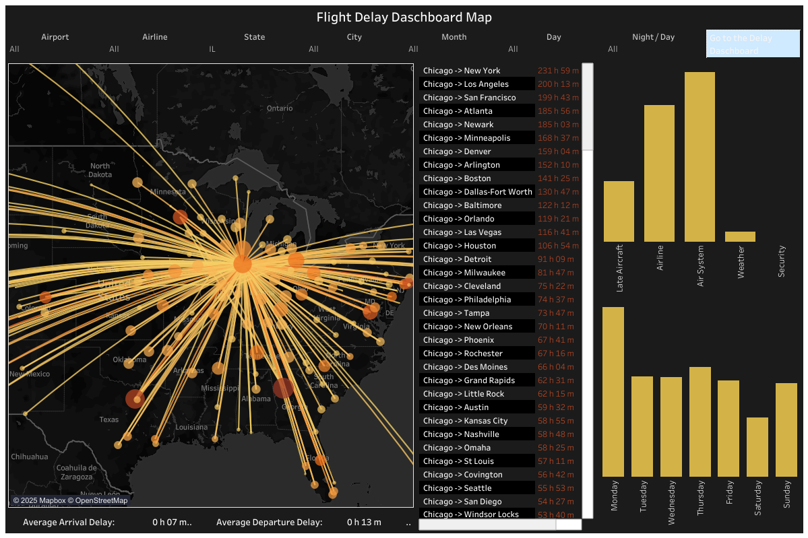
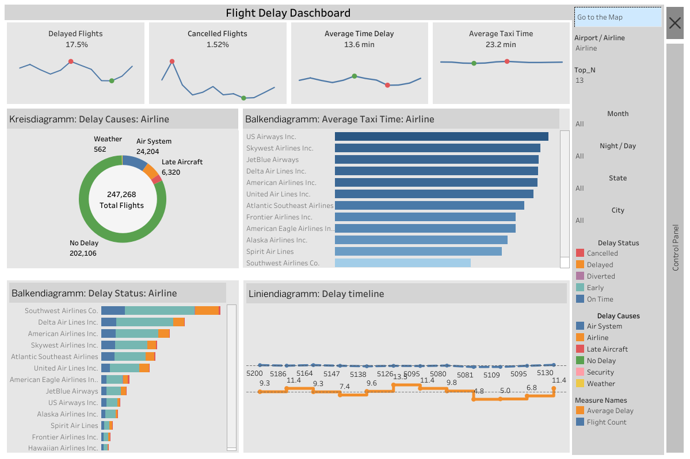

# Flight Delay Analysis Dashboard ✈️

Interactive Tableau dashboard analyzing **5.8 million US flights in 2015** (USDOT / Kaggle dataset).  
Focus: departure & arrival delays, cancellations, taxi times, and root causes across airlines and routes — with special emphasis on high-traffic Chicago (ORD) hub.

## Dataset
- Source: [USDOT Flight Delays 2015 (Kaggle)](https://www.kaggle.com/datasets/usdot/flight-delays)
- 5.8 M records · 31 airlines · 322 airports

## Key Features & Filters
- Geospatial route map (Chicago-centric) with delay intensity
- Airline & airport performance comparison
- Delay causes breakdown (Weather 24 %, Air System 10 %, Late Aircraft, etc.)
- Month / Day of week / Night vs Day filters
- KPIs: 17.5 % delayed · 1.5 % cancelled · 13.6 min avg delay · 23.2 min avg taxi time

## Live Dashboard
👉 [Tableau Public – Flight Delay Dashboard](https://public.tableau.com/views/Project_Flights_Final/FlightDelayDaschboard?:language=en-US&publish=yes&:sid=&:redirect=auth&:display_count=n&:origin=viz_share_link)

## Screenshots

## Tech & Skills Demonstrated
- Tableau Desktop/Public
- Data cleaning & preparation
- Calculated fields, parameters, LOD expressions
- Geospatial visualization (Mapbox)
- Interactive dashboard design

Created during IT Career Hub Data Analytics bootcamp (Dec 2024 – Oct 2025)  
Former Chief Officer (18+ years maritime operations) → Data Analyst

Open to remote/hybrid Data Analyst roles in Germany  
[LinkedIn](https://www.linkedin.com/in/yuriy-volzhyn) · volzhynyuriy@gmail.com
